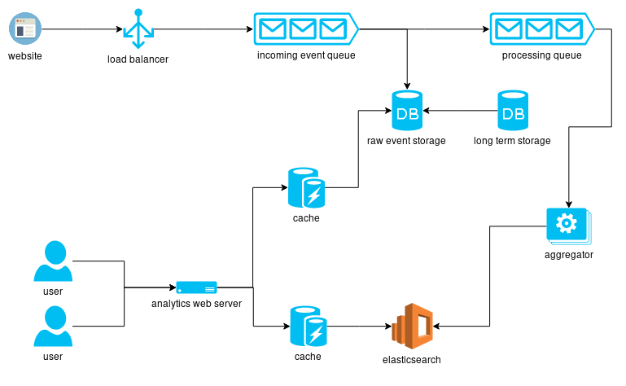

# Immutable Queue
I used a traditional pattern to implementing an immutable queue which uses 2 stacks. One to store incoming messages and one to store outgoing messages.
Enqueued messages are added to the incoming stack and dequeued messages are taken from the outgoing stack. If the outgoing stack is empty, the incoming messages are "flipped" onto the outgoing stack. This preserves the FIFO nature and it avoids copying an entire list every time a new item is enqueued or dequeued.

The only deviation I made from a traditional implementation is when to apply the flipping operation. Typically, this is done upon dequeuing an item. However, because the provided interface has the `head()` and `deQueue()` methods separated, this would lead to a lot of double flips (when `head()` and `dequeue()` are called in succession). 
To avoid this I chose to do the stack flipping in the Queue constructor.

## Tests
I provided a small test suite for the `ImmutableQueue` class, but not for the `ImmutableStack` class. This was left out in the interest of time. In a real project I would strive to write a comprehensive test suite for both classes if time constraints allow it.

# Analytics system design

## Analysis

### Write volume
The system needs to support billions of writes per day.

This means:

* average writes/sec = ~10 000/sec
* peak writes/sec = 100 000 ~ 1 000 000 / sec

If we plan for a product lifetime between 10 and 100 years, we expect ~10^14 events in total.

Each event consists of at least:

* event type
* sending website id
* timestamp
* website user info
* extra event info

If we estimate the average event size to be around 1000 chars (many small events, few large events), we expect about 10^15 bytes per year (1 petabyte).

### Read volume
Millions of customers request aggregated data.
To handle this we need:

* A replicated web server
* A backend able to handle many searches quickly

### Data processing
The events, as described before have some event info (e.g. country of origin, user info, etc.) and some data about which website generated the event. This makes it relatively easy to split up processing. We can create completely horizontally scalable parallel queues for each user. 

These events have to be processed into aggregated statistics.
In the simplest form, this simply aggregates event info (e.g. country of origin, user info, etc.) in ever-larger timeframes.

For example, events for each website are aggregated per:

* minute
* hour
* day
* week
* month
* year

## Design
To deal with the constraints described above, I propose the following solution.

### Events
Websites which generate analytics contact a load balancer to find the correct event queue to put their events into. These queues are split up per user of the framework and located in the region where the user has his/her account to maximize the chance of the generated events and processing to be done in the same geographical region.

For the implementation of these queues and aggregators (see below) we can use a system like [Apache Kafka](https://kafka.apache.org/ "Apache Kafka"). It provides safe stream processing, with different topics and support for replication. 

### DB
Events are periodically pulled out of these queues and put into the event database and added to the processing queue.
This event database is a replicated NoSQL db like [Apache Cassandra](https://cassandra.apache.org/ "Apache Cassandra"). It will keep the events for the last year so the raw event data is accessible to the end user. 

After one year, an automated job will pull this data from the db and move it to long term storage. This is a very cheap, slow to access datastore. It uses blu-ray discs or disconnected hard drives to store data. This vastly reduces the cost of storage for data that will rarely be accessed. However, it allows us to reprocess historical data if needed.

### Processing
As described above, we need to aggregate the data based on time-series for each client. We can create aggregator processing queues in Kafka. Each of these is associated with a certain client and subscribes to the appropriate processing queue topic. It will receive new events from this processing queue every minute. This data is then aggregated into ever larger timeframes.
To achieve this, the aggregator keeps track of the combined statistics for the current running hour, day, week, month and year.
To allow access to this data, it will write the result of this aggregation to the elasticsearch storage once every minute.

For very large volume customers, we could expand this by having one aggregator per region and an additional aggregator which aggregates the results from those initial aggregators.

### Client access
The clients can access the analytics through a web ui. We use a web server to serve these pages. This server will fetch data from the event db and the elasticsearch cluster. Both of these queries are cached.

## Evaluation
The proposed design works well because it is easily scalable and cost-effective. To make the system more reliable and performant, further thought should be given to:

* Db partitioning
* Efficient processing & combination of data from various sources
* How to deal with clients with very large volumes of data (i.e. allow partitioning & multiple aggregators for 1 client)
